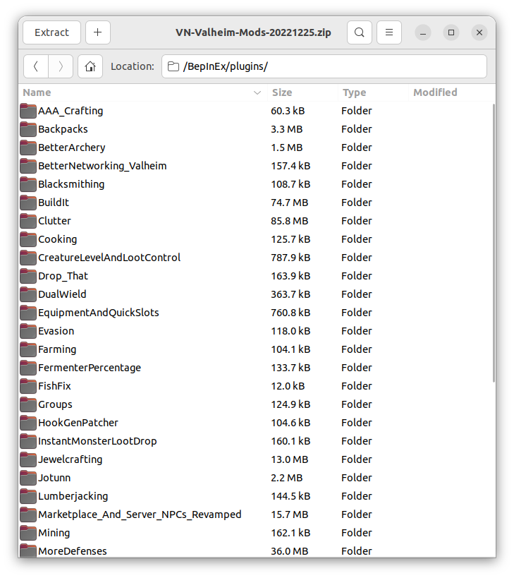
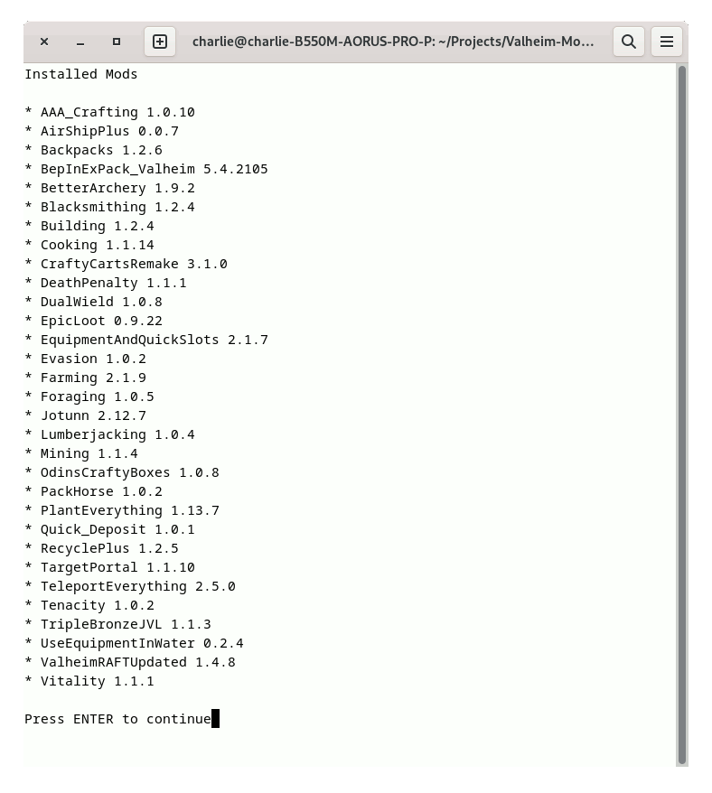
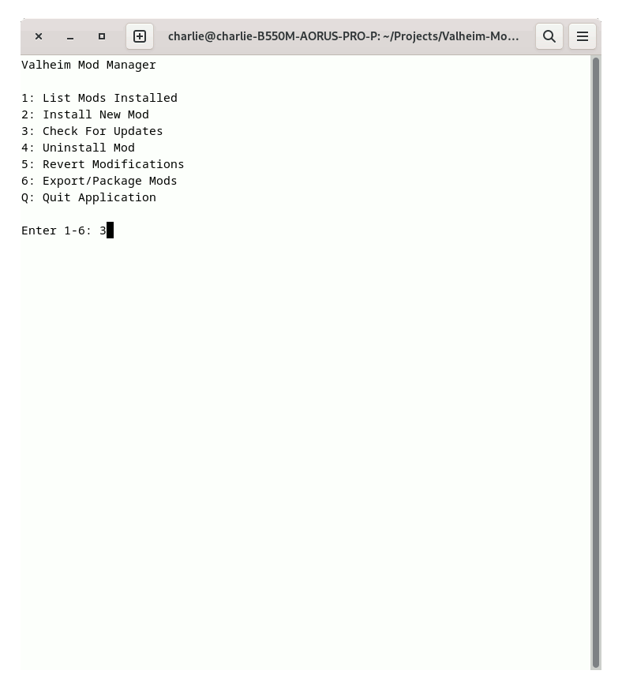

# Valheim Mod Manager

## Overview

Simple command-line application to manage mods for Valheim from Thunderstore.io.

* Manages locally installed mods for testing
* Provides ZIP export for players
* Deploys mods to server automatically upon publishing




<video width="1280" height="720" controls=true autoplay=true muted=true>
  <source src="docs/videos/Valheim-mod-manager-demo.webm" type="video/webm">
</video> 

[Valheim mod manager demo video](docs/videos/Valheim-mod-manager-demo.webm)

## Requirements
(with pip)

```bash
pip3 install packaging python-magic paramiko
````

(with native packages)

```bash
sudo apt install python3-packaging python3-magic python3-paramiko python3-dateutil
```

Python3 and the [packaging, python-magic, paramiko] packages.
Tested on Ubuntu 22.04 and Debian 12 with Python 3.11

## Configuration

Copy `config.yml.DEFAULT` to `config.yml` and adjust as necessary.

### debug

Set the debug flag to `true` for debug output

### gamedir

Set to the location of your local Valheim install

### exportprefix

Set to the filename to export, useful for prepending your server name or something meaningful.

### exportdir

Directory to export bundled mods and change information, feel free to set to a directory managed by Nextcloud for auto-deployment for your users!

### updatedays

Set the number of days for "updated" packages, setting this to '14' will export any plugin updated in the last 14 days in the "updated" package export

### sftp_host

Set to the IP or hostname to automatically deploy "server" plugins during export.
if empty, this logic is skipped

### sftp_user

Username to connect with via SSH, (key-based authentication only)

### sftp_path

Path on the dedicated server where Valheim is installed (for auto-deployment)

### override_server

Comma-separated list of plugins to force server deployment
Usually only mods flagged with the "server" tag are deployed,
but sometimes mod developers don't include that.


## Using

Run `./cli.py` to run the interactive script.

```bash
Valheim Mod Manager

1: List Mods Installed
2: Install New Mod
3: Check For Updates
4: Uninstall Mod
5: Revert Modifications
6: Export/Package Mods
Q: Quit Application

Enter 1-6:
```

The general workflow for using this script: run the script to load your current game mods into the manager.  You may need to select which author the mod should use (some mods are published by different authors but have the same name).

### 1. List Mods Installed



Listing the mods installed is self-explanatory; it lists the mods and versions you have installed currently.

### 2. Install New


Installing a new mod can be done by searching for the mod name or thunderstore URL.
You will be presented with the option of which version to install, (defaults to the newest version).
Dependencies are handled automatically.

### 3. Check for Updates



Once loaded, you can update your local mods via `Check For Updates`.
This will provide you the ability to quickly update any/all mods installed.

### 4. Uninstall Mod


Mod removal is performed via `Uninstall Mod`, though for user export packages, it is important to inform users of which mods are removed as they will need to manually remove those mods upon updating.
(ZIP files don't support a "delete this directory" option sadly.)

Your local game client is automatically updated when mods are installed, removed, or updated.
This allows you to test a mod prior to deployment.
**(Note, this is important!  Some mods will break your game/character!)**
For misbehaving mods, they can be reverted via `Revert Modifications`.
This will roll back a mod to its original deployed status (either removed altogether or reset back to a specific version).

Lastly, `Export/Package Mods` will create a variety of files for your users.  A full export will contain all mods and BepInEx, an update zip which contains only mods updated in the last (by default) 14 days, a CHANGELOG which can be published containing all changes, and a MODS file which contains all currently installed mods and their versions.


## Server Mods

For mods that are tagged with the `Server-side` flag, 
they are also copied into `.cache/server` for deployment to your private server.

If the `sftp_` options are configured, the library will automatically upload
these mods to your game server upon releasing a new bundle.

For manual deployments, simply copy these files to your game server when ready.


## Technical Notes

This application makes heavy use of file caching. 
The full packages list from thunderstore.io is only downloaded once an hour (by default)
and mod packages are stored in `.cache/packages`, so repeated installs 
of the same package do not need to download from the site again.
